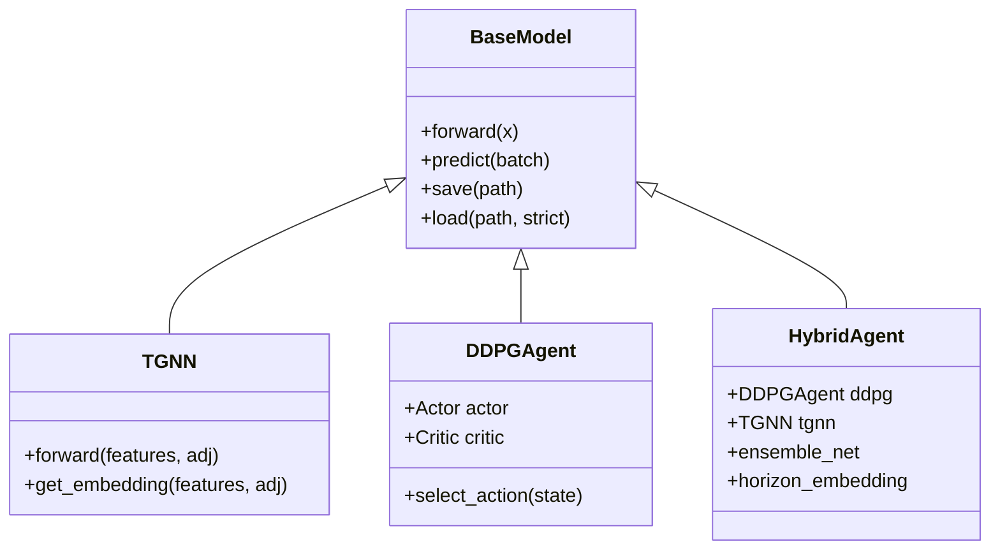

# Models Module (딥러닝 아키텍처)

> ✅ **해결된 이슈**:
> - **포트폴리오 쏠림**: `softmax_temperature` 적용으로 해결됨 (기본값: 10.0)

`src/models`는 프로젝트에서 사용되는 모든 딥러닝 모델의 구현체를 포함합니다. Clean Architecture 원칙에 따라, 모델은 오직 `forward`와 `predict` 로직만 가지며, 학습 루프나 데이터 로딩 로직은 포함하지 않습니다.

## 📦 모듈 구조

| 모듈 | 역할 |
|---|---|
| `base_model.py` | 모든 모델이 상속받는 추상 기본 클래스 (ABC). 공통 인터페이스 및 유틸리티 제공. |
| `layers.py` | 재사용 가능한 신경망 레이어 (Attention, GAT Layer 등). |
| `tgnn/` | **Temporal Graph Neural Network** 구현체 (Encoder). |
| `ddpg/` | **Deep Deterministic Policy Gradient** (Actor-Critic) 강화학습 에이전트. |
| `hybrid/` | TGNN Encoder와 RL Agent를 결합한 하이브리드 모델. |

## 🏗️ 상속 구조 (Class Hierarchy)



## 🔧 주요 기능 상세

### 1. BaseModel (`base_model.py`)
모든 모델의 표준 인터페이스를 정의합니다.
*   **스마트 전이 학습 (Smart Transfer Learning)**: `load(strict=False)` 호출 시, 저장된 가중치와 현재 모델의 Shape을 레이어별로 비교합니다. 크기가 일치하는 가중치만 선별적으로 로드하여, 종목 수($N$)가 변경되더라도 유연하게 파라미터를 복구할 수 있습니다.

### 2. TGNN (`tgnn/`)
*   **Architecture**: **Context-Aware Dual-Path Encoder**
    *   **Price Encoder**: 종목별 가격 데이터($[B, N, T, 5]$) 학습 (Gated Recurrent Unit)
    *   **Macro Encoder**: 거시경제 지표($[B, N, T, 5]$) 학습 (1D-CNN)
*   **Input**: `prices` $[B, N, T, 5]$, `adj` $[B, N, N]$, `macro` $[B, N, T, 5]$
*   **Output**: $[B, N, 4]$ (Multi-task Momentum Predictions)

### 3. DDPG (`ddpg/`)
연속적인 행동 공간(Portfolio Weights)을 제어하는 강화학습 모델입니다.
*   **Actor**: 상태(State)를 입력받아 포트폴리오 비중(Action)을 출력.
*   **Critic**: 상태와 행동을 입력받아 Q-Value를 추정.

## 🚀 사용법 (Usage)

```python
from src.models.tgnn.model import TGNN

# 모델 초기화
model = TGNN(config)

# Forward Pass (학습 시)
# Context-Aware: 가격과 매크로 지표 분리 입력
predictions, embeddings = model(prices, adj_matrix, macro=macro_tensor)

# Inference (예측 시)
preds = model.predict(batch_data) # 내부적으로 자동 분할 처리

# 가중치 저장 및 로드
model.save("best_model.pth")
model.load("best_model.pth", strict=False) # Shape Mismatch 자동 처리
```
